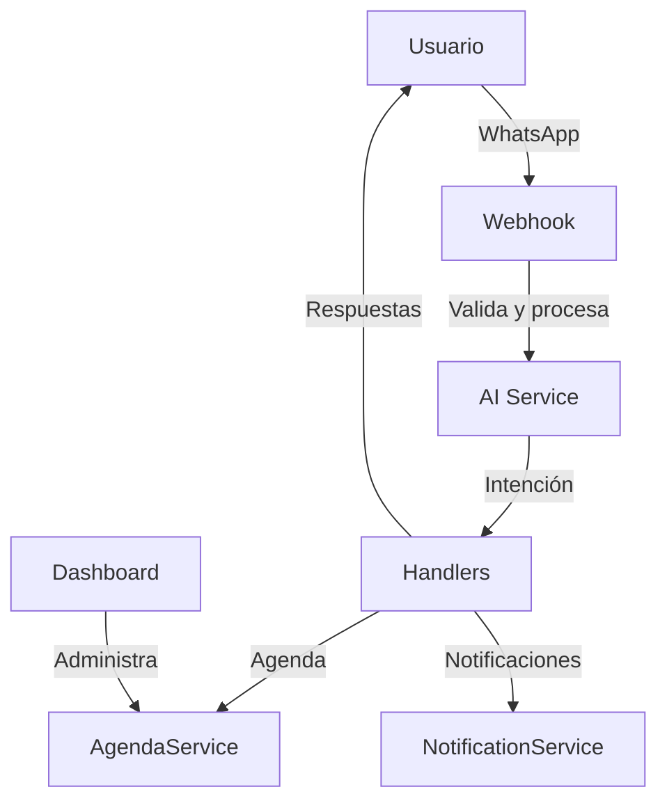

# 🤖 Asistente de Salud

¡Bienvenido al proyecto **Asistente de Salud**! Un chatbot inteligente para la gestión de turnos médicos, recordatorios y atención automatizada vía WhatsApp y panel web.

---

## 📋 Descripción

Este proyecto implementa un asistente virtual para clínicas y consultorios, permitiendo:
- Agendamiento y cancelación de turnos
- Recordatorios automáticos y mensajes de seguimiento
- Panel administrativo para gestión de pacientes y estadísticas
- Integración con WhatsApp (Twilio) y OpenAI para IA conversacional

---

## 🚀 Instalación

### Opción 1: Usando Docker 🐳

```bash
git clone https://github.com/tu-usuario/asistente_salud.git
cd asistente_salud
cp .env.example .env
# Edita .env con tus claves

docker-compose up --build
```

### Opción 2: Manual (sin Docker)

```bash
git clone https://github.com/tu-usuario/asistente_salud.git
cd asistente_salud
python -m venv venv
source venv/bin/activate  # o venv\Scripts\activate en Windows
pip install -r requirements.txt
cp .env.example .env
# Edita .env con tus claves

python -m app.main
```

---

## ⚙️ Variables de entorno necesarias (`.env`)

- `SECRET_KEY`: Clave secreta Flask
- `DEBUG`: Modo debug (True/False)
- `HOST`, `PORT`: Host y puerto
- `CLINIC_NAME`: Nombre de la clínica
- `TWILIO_ACCOUNT_SID`, `TWILIO_AUTH_TOKEN`, `TWILIO_PHONE_NUMBER`: Credenciales de Twilio
- `OPENAI_API_KEY`: Clave de OpenAI
- `DATABASE_URL`: URL de la base de datos
- `EMAIL_HOST`, `EMAIL_PORT`, `EMAIL_USER`, `EMAIL_PASSWORD`: (Opcional) Configuración de email

Ver `.env.example` para todos los campos.

---

## 🧪 Cómo correr los tests

```bash
pytest tests/
```

Incluye tests unitarios para servicios y rutas principales.

---

## 🗺️ Diagrama de flujo del chatbot



---

## 📁 Estructura del proyecto

```
app/
  config.py
  main.py
  logging_config.py
  routes/
    api_routes.py
    dashboard_routes.py
    webhook_routes.py
  schemas/
    turno_schema.py
    mensaje_entrada_schema.py
  services/
    agenda_service.py
    scheduler.py
    whatsapp_service.py
    ...
  utils/
    validators.py
    time_utils.py
    message_utils.py
    keywords.py
    ...

/tests/
  test_agenda_service.py
  test_webhook_routes.py
  ...

requirements.txt
Dockerfile
docker-compose.yml
.env.example
README.md
```

---

## ✨ Contribuciones

¡Pull requests y sugerencias son bienvenidas! 

---

## 📝 Licencia

MIT 