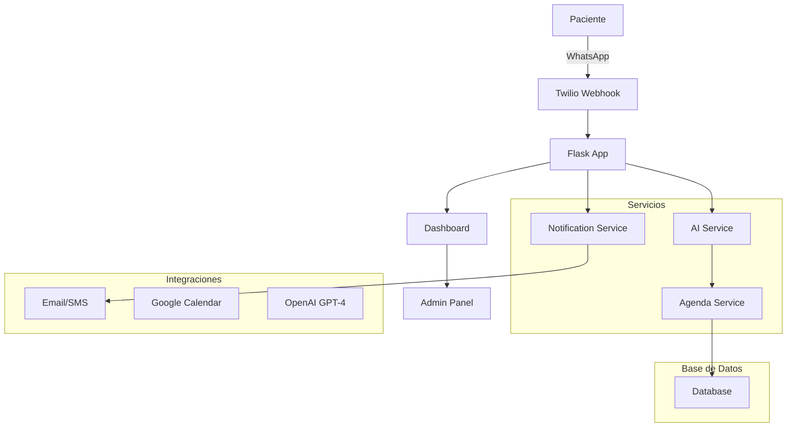

# 🤖 Asistente Virtual para Clínicas y Consultorios

Un bot inteligente que automatiza la gestión de turnos y responde preguntas frecuentes por WhatsApp para clínicas y consultorios médicos.

## 🏗️ Arquitectura del Sistema



## 🚀 Características

- ✅ **IA Conversacional** - Integración con OpenAI GPT-4
- ✅ **Gestión de Turnos** - Crear, modificar, cancelar citas
- ✅ **Notificaciones** - WhatsApp, Email, SMS
- ✅ **Dashboard Admin** - Panel de administración web
- ✅ **API REST** - Integración con sistemas externos
- ✅ **Logging Profesional** - Monitoreo y debugging
- ✅ **Validaciones** - Schemas con Pydantic
- ✅ **Tests Unitarios** - Cobertura de código

## 📋 Instalación

### 1. Clonar repositorio
```bash
git clone https://github.com/josedaminato/chatbot.git
cd chatbot
```

### 2. Instalar dependencias
```bash
pip install -r requirements.txt
```

### 3. Configurar variables de entorno
```bash
# Copiar archivo de ejemplo
cp config.example.env .env

# Editar variables según tu configuración
nano .env
```

### 4. Configurar base de datos
```bash
# PostgreSQL (recomendado)
createdb asistente_salud

# O SQLite para desarrollo
# DATABASE_URL=sqlite:///database.db
```

### 5. Ejecutar aplicación
```bash
python app/main.py
```

## ⚙️ Configuración

### Variables de Entorno Requeridas

```env
# Clínica
CLINIC_NAME=Tu Clínica
PROFESSIONAL_EMAIL=tu@email.com

# Twilio
TWILIO_ACCOUNT_SID=tu_sid
TWILIO_AUTH_TOKEN=tu_token
TWILIO_WHATSAPP_NUMBER=whatsapp:+1234567890

# OpenAI
OPENAI_API_KEY=tu_api_key

# Dashboard
SECRET_KEY=clave-secreta-segura
```

### Configuración de WhatsApp

1. **Crear cuenta en Twilio**
2. **Configurar WhatsApp Sandbox**
3. **Configurar webhook URL**: `https://tu-dominio.com/webhook`

## 📊 Estructura del Proyecto

```
asistente_salud/
├── app/
│   ├── services/          # Lógica de negocio
│   ├── routes/           # Endpoints API
│   ├── schemas/          # Validaciones Pydantic
│   ├── handlers/         # Manejadores de mensajes
│   ├── utils/            # Utilidades
│   ├── config.py         # Configuración centralizada
│   └── main.py           # Aplicación principal
├── tests/                # Tests unitarios
├── logs/                 # Archivos de log
├── requirements.txt      # Dependencias
└── README.md            # Documentación
```

## 🔧 API Endpoints

### Webhook
- `POST /webhook` - Recibir mensajes de WhatsApp
- `POST /webhook/status` - Status de mensajes
- `GET /webhook/health` - Health check

### Dashboard
- `GET /dashboard/` - Panel principal
- `GET /dashboard/appointments` - Gestión de turnos
- `GET /dashboard/notifications` - Notificaciones

### API REST
- `GET /api/v1/appointments` - Obtener turnos
- `POST /api/v1/appointments` - Crear turno
- `GET /api/v1/available-slots` - Horarios disponibles

## 🧪 Testing

```bash
# Ejecutar tests
python -m pytest tests/

# Cobertura de código
coverage run -m pytest tests/
coverage report
```

## 📈 Monitoreo

### Logs
- `logs/app.log` - Logs generales
- `logs/error.log` - Errores específicos

### Métricas
- Turnos creados/cancelados
- Mensajes procesados
- Tiempo de respuesta
- Errores por servicio

## 🔒 Seguridad

- ✅ Variables de entorno para secretos
- ✅ Validación de entrada con Pydantic
- ✅ Logging seguro (sin datos sensibles)
- ✅ Autenticación en dashboard
- ✅ HTTPS en producción

## 🚀 Deployment

### Heroku
```bash
# Configurar variables de entorno
heroku config:set TWILIO_ACCOUNT_SID=xxx
heroku config:set OPENAI_API_KEY=xxx

# Deploy
git push heroku main
```

### Docker
```bash
# Construir imagen
docker build -t asistente-salud .

# Ejecutar contenedor
docker run -p 5000:5000 asistente-salud
```

## 🤝 Contribuir

1. Fork el proyecto
2. Crear rama feature (`git checkout -b feature/nueva-funcionalidad`)
3. Commit cambios (`git commit -am 'Agregar nueva funcionalidad'`)
4. Push a la rama (`git push origin feature/nueva-funcionalidad`)
5. Crear Pull Request

## 📄 Licencia

Este proyecto está bajo la Licencia MIT. Ver `LICENSE` para más detalles.

## 🆘 Soporte

- 📧 Email: soporte@ejemplo.com
- 📱 WhatsApp: +1234567890
- 📖 Documentación: [Wiki del proyecto](https://github.com/josedaminato/chatbot/wiki)

---

**Desarrollado con ❤️ para mejorar la atención médica** 